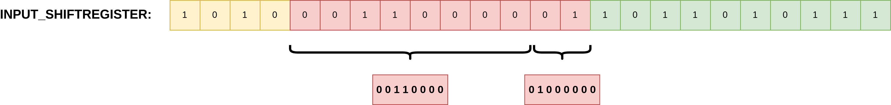

# Accelerator for calculating Tanimoto index

2023-24 József Mózer @ BME MIT
Feel free to reach out to me on GitHub, or send an email to jozsef.mozer@edu.bme.hu.

## Table of contents

- [Introduction](#introduction)
- [Project structure](#project-structure)
- [RTL Kernel](#rtl-kernel)
  - [Bit Adder](#bit-adder)
  - [Bit Counter](#bit-counter)
  - [Bit Counter Wrapper](#bit-counter-wrapper)
  - [CNT1](#CNT1)
  - [Comparator](#comparator)
  - [Vector Concatenator](#vector-concatenator)
  - [Top Level](#top-level)

## Introduction

The Tanimoto index, also known as Tanimoto dissimilarity, is a metric used in chemical informatics to [determine the similarity of two molecules](https://jcheminf.biomedcentral.com/articles/10.1186/s13321-015-0069-3). Specific attributes of molecules are mapped to a binary vector or a 2D bitmap, often reffered to as molecular fingerprints. The Tanimoto index for two such fingerprints A and B is defined as the Jaccard index of the two sets, with bits in certain positions indicating the presence (1) or absence (0) of a set member. Therefore tan(A, B) = |A & B| / (|A| + |B|), where |A| is the binary weight of bitmap A.

Calculating this metric in software is slow, due to the slowness of division, and the difficulty of handling large binary vectors with arbitrary widths (e. g. 920, or 320x320). The goal is to create an efficient Tanimoto index calculator in Verilog and package it with the AMD Vitis RTL kernel flow.

## Project structure

The implemented hardware is consists of three parts:

### RTL kernel

The RTL kernel can be found in `tanimoto_rtl/verilog/sources_1/`. It is built of a pipeline, that's depth is a synthesis parameter called SHR_DEPTH. The kernel reads vectors form an AXI-Stream port, the width of which can be between 50% and 100% of the fingerprint width. The first SHR_DEPTH vectors will be compared aginst the vectors arriving after. Binary weight calculation is done by adder trees, division is avoided by pre-loading BRAM blocks with potential division results. Vectors' index, thats Tanimoto dissimilarity index is over the configured threshold are returned through a hierarchic elastic memory buffer. They are output concatenated through an AXI Stream port.

### HLS interface

A DMA-like module written in Vitis HLS, that bridges the AXI-4 ports of the processor subsystem and the AXI Stream interfaces of the RTL kernel.

### Processor subsystem

A PS, containing an AXI interface for burst transactions to and from the accelerator kernel and an AXI-BRAM controller for configuring the BRAMs with division results.

## Build process

The build process revolves around the v++ linker. First, the RTL kernel source files are backaged into a single IP block with `make rtl_ip`. Then it is packaged with `make rtl_xo`. Afterwards, the HLS interface is also packaged with `make hls_xo`, and the platform is created with `make platform`. (This requires a prior PetaLinux and Vitis environment setup. For these steps, please refer to the [official documentation](https://github.com/Xilinx/Vitis-Tutorials/blob/2023.2/Vitis_Platform_Creation/Design_Tutorials/02-Edge-AI-ZCU104/step2.md) by AMD. NOTE: Switch zcu104-revc to zcu106-reva or your own platform.) Finally the Vitis linker can be launched to create the final acceleration platform with `make xclbin`.

To see all Makefile options, run `make help`.

## RTL Kernel

### Bit Adder

The bit adder module is a fully combinational adder module, that sums all bits in the input word.

- Parameter:
  - VECTOR_WIDTH: default is 6, since the number of inputs on a Xilinx/AMD FPGA LUT is 6. This way minimal resources are used.
- Input:
  - i_Vector
- Output:
  - o_Sum

### Bit Counter

This module implements an adder-tree based pipeline that counts the number of bits in the input vector. The 0th level of the pipeline is built from **bit_adder** modules, the outputs of which are the sum of high bits in every six bits of the input vector. Every subsequent pipeline stage is an adder that sums three results from the previous stage. Input words are zero-padded to the width of 3^**PIPELINE_DEPTH***6, which does not influence the output value, but allows for the parametrized instantion of adders.

- Parameters:
  - VECTOR_WIDTH: width of the input word.
  - GRANULE_WIDTH: width of the first stage **bit_adder**s, advised to be as wide as LUT inputs on the target platform (6).
- Input:
  - i_Vector
- Output:
  - o_Sum

#### Block diagram

#### Wave example

VECTOR_WIDTH is 8, therefore the pipeline depth is 1.

### CNT1

Wrapper encapsulating vector weight counting logic. Valid and other control signals are delayed by the pipeline depth of the instantiated **bit_cntr** module. Input words are counted to determine when the last word of a vector has been received, so that the corresponding calculated weight can be emitted after delaying the input data appropriately.

- Parameters
  - VECTOR_WIDTH
  - BUS_WIDTH
  - SUB_VECTOR_NO: how many bus cycles transfer a single fingerprint.
  - GRANULE_WIDTH: see **bit_adder**.
- Input
  - i_Vector
  - i_Valid
- Output
  - o_SubVector: delayed input vector.
  - o_Valid
  - o_Cnt: Sum output.
  - o_CntNew: Output on o_Cnt contains valid data.

#### Block diagram

#### Waveform

Delay depends on i_Vector width. In the current example it is 1 clk, for 128 bits it would be 4 clk (see **bit_cntr**).

### Comparator

The comparator module uses a block RAM instance to determine whether the Tanimoto dissimilarity index is over or under a certain threshold, without actually calculating the index. Division is avoided, by pre-loading potential division results to **u_result_ram**, which is indexed by the binary weight of the A&B vector. The output of the RAM is then compared against the sum of the binary weights of vectors A and B. When the sum of the weights is greater than the threshold read from the RAM, the output of the module is high.

**u_result_ram** can be configured through a standard BRAM interface.

- Parameters
  - VECTOR_WIDTH
- Input
  - i_CntA, i_CntB, i_CntC: vector weights, where C = A & B.
  - i_Valid
  - i_BRAM_*: BRAM control signals.
- Output
  - o_Dout: 1 - over threshold, 0 - under threshold
  - o_Valid

#### Block diagram

### Vector concatenator

Fingerprints are stored continuously in RAM, regardless of their width. Therefore input vectors that are received on AXI Stream, need to be separated and zero-padded before they are fed to the accelerator. **vec_cat** implements this with an internal shiftregister and additional multiplexer logic. Vectors are read from the bus and shifted into the shiftregister, from where their MSB is selected by an index counter. The selected range is determined by a state machine (either the full BUS_WIDTH is selected, or the result is zero-padded), the selected vector portion is written to the output of the module. In case the shiftregister would overflow in the next bus cycle, the read signal is deasserted and the index register's value is reduced by BUS_WIDTH, since the next vector is already loaded into the shiftregister. Reading then continues in the next cycle.
Each vector is assigned an ID, which is their position in the dataset. This is achieved by a counter that increments every time the last word of the current vector is read from the bus.

- Parameters
  - BUS_WIDTH
  - VECTOR_WIDTH
  - VEC_ID_WIDTH: depends on how many vectors are part of the current dataset.
- Input (interface behavior is similar to AXI Stream)
  - i_Vector
  - i_Valid
- Output
  - o_Vector
  - o_Valid
  - o_VecID
  - o_Read

#### Block diagram

#### Input -> Output

#### Shiftregister multiplexing behavior

#### Waveform for VECTOR_WIDTH=10, BUS_WIDTH=8

When o_Read is set to 0 by the vector concatenator, the internal shiftregister would overflow and some of the next to-be-emitted vector would be lost. How many times the bus is stopped, depends on the VECTOR_WIDTH/BUS_WIDTH ratio, as well as the size of the internal shiftregister. (The bus is usually stopped at a regular interval, the current example is werd due to the small vector size.)

### Top Level

The **tanimoto_top** module implements the top level pipeline. It instantiates **vec_cat** on the input. Sub-vectors leaving the concatenator module are fed through a **cnt1** module. The resulting binary weights are stored in shiftregisters, alongside the vectors themselves.
The pipeline is controlled by an FSM with two states. In the LOAD_REF state, vectors and their weights are loaded into the reference shiftregisters. After SHR_DEPTH number of vectors have been received, the pipeline is switched to the COMPARE state. In this state, incoming vectors and their corresponding weights are shifted through compare shiftregisters. Every two cycles (depends on how many bus cycles a full fingerprint is received in), compare and reference vectors on the same index are put through AND gates, the result of which is fed to a **cnt1** module (which are instantiated SHR_DEPTH times).
The results are then passed to comparator modules, which determine whether the compare and reference vectors are over or under the programmed Tanimoto threshold.
Vector IDs, that are propagated alongside the vector weight, are then either discarded, or recorded to a FIFO-tree (a hierarchical elastic memory buffer), which propagates them to the output of the top module.

#### Block diagram

Draw.io managed to not save the top-level block diagram three times in a row, even though I clearly told it to. Thus, this remains a TODO for now.